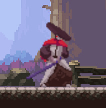
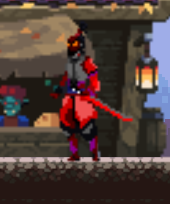

# Oil Blood
Jogo em desenvolvimento com base em conteudo disponivel no youtube por <a href="https://www.youtube.com/c/ChrisCourses">Chris Courses</a>.
Este é um simples jogo de luta onde dois samurais se enfrentam em uma cidade futuristica. (em desenvolvimento)

## Personagens com suas particularidades.
* O primeiro personagem, (nome será definido)

</img> 
Caracteristicas: 
<!--ts-->
    - Vantagens
        - Precisão aprimorada: sua espada consegue atingir seu inimigo a uma distancia maior.
        - BackRoll: consegue se evadir rapidamente do perigo (em desenvolvimento)
        - Ultima gota de oleo: se em combate sofrer um ataque fatal tem uma chance grande de permanecer de pé e em combate. (bug que virou feat, poderá ser aperfeiçoada)
    - Desvantagens
        - Precisão aprimorada: para conseguir atingir seus inimigos a uma distancia segura seus ataques são levementes mais lentos.
<!--te-->
* O segundo personagem, (nome será definido)

</img> 
Caracteristicas: 
<!--ts-->
    - Vantagens
        - Wd40: Este personagem consegue atacar em uma velocidade maior que seu inimgo.
        - Slash: não é o guitarrista, este personagem consegue avançar com um ataque rapido em direção a seu inimigo. (em desenvolvimento)
    - Desvantagens
        - Lamina: para combinar com seu estilo de combate este personagem usa uma lamina curta, por isso ele precisa se aproximar um pouco mais de seu inimigo.
        -Uso de Combustivel: dificilmente esse personagem poderá se manter de pé após receber um ataque fatal. (bug que virou feat, poderá ser removida)
<!--te-->

##To do
<ul>
<li>Arte</li>
<ul>
<li>Atualização das imagens para combinar com o tema mecha (vai dar trabalho, não tenho muita experiencia com pixel art)</li>
<li>Background vivo:</li>
<ul>
<li>Atualização da loja + vendedor</li>
<li>Gato mecha adcionado ao background com sua movimentação</li>
<li>Trem que passa ao fundo</li>
</ul>
<li>Movimentações:</li>
<ul>
<li>Movimentação dos personagens e ataques.
</ul>
</ul>
<li>Mecanica</li>
<ul>
<li>Barra de stamina, responsavel por definir as vezes que um personagem pode usar uma habilidade</li>
<li>Defesa + dano a stamina</li>
<li>Habilidades especiais dos personagens</li>
<li>Correção de alguns bugs</li>
<li>Balanceamento dos personagens: vida, dano, velocidade, etc...</li>
</ul>
<li>Facil acesso
<ul>
<li>Hospedar jogo para facil acesso de jogadores</li></ul></ul></ul></ul>

# Como jogar
Atualmente para você testar esse jogo não é tão simples como um clique, o jogo tambem não dispoem de um menu, basta jogar, e para isso você terá que fazer o download desse repositorio e abrir o arquivo "index.html" na pasta raiz desse repositorio para que o jogo inicie no seu navegador.
- Para jogar é necessario duas pessoas para comandar cada um dos personagens.
- Player vs Player, ganha quem conseguir derrubar seu inimigo primeiro, o jogo dispoem de um contador de segundos que conta 1 minuto, caso esse tempo termine é definido vencedor o jogador com maior quantidade de vida.
- Caso um Player perca ou o tempo termine para iniciar uma nova partida basta você recarregar a pagina do seu navegador (F5, ou CRTL + R).

##Teclas de movimentação e combate

<!--ts-->
    - Player 1
    - W: Pular
    - A: Mover para Esquerda
    - D: Mover para Direita
    - S: Defender (em desenvolvimento)
    - Space: Atacar
<!--te-->
<!--ts-->
    - Player 2
    - :arrow_up: : Pular
    - :arrow_left: : Mover para Esquerda
    - :arrow_right: : Mover para Direita
    - :arrow_down: : Atacar
    - Num5: Defender (em desenvolvimento)
<!--te-->
Boa sorte!

#Team
Igor "Fakada" Santos - Programador / Direção de Arte
Romulo "SK" Estevam - Artista

## Sobre
Esse projeto está sendo desenvolvido como hobbie e com finalidade de aprender novos conceitos voltados ao mundo da programação, meu primeiro contato com HTML canvas e um dos meus primeiros contatos com orientação a objeto voltado a jogos que tem me ajudado a entender sobre esse conceito, caso tenha interesse em iniciar um projeto com essa base ou similar basta utilizar o conteudo disponivel canal do Youtuber <a href="https://www.youtube.com/c/ChrisCourses">Chris Courses</a>, aqui está o link para ter a base desse projeto que estou desenvolvendo de um jogo de luta: <a href="https://www.youtube.com/watch?v=vyqbNFMDRGQ&t=481s">Youtube: JavaScript Fighting Game Tutorial with HTML Canvas</a>

## Creditos
Base do projeto e conceitos: <a href="https://www.youtube.com/c/ChrisCourses">Chris Courses</a>
- Artes iniciais
<a href="https://brullov.itch.io/oak-woods">Background</a>
<a href="https://luizmelo.itch.io">Personagens</a>: <a href="https://twitter.com/LuizGdeMelo">Luiz Melo</a>

Se você consegue ver essa mensagem significa que este projeto não foi finalizado, e caso tenha jogado e queira me dar um feedback uma solução para algum bug ou alguma sugestao basta entrar em contato comigo: <a href="https://www.linkedin.com/in/devsantos/">LinkdIn</a>
